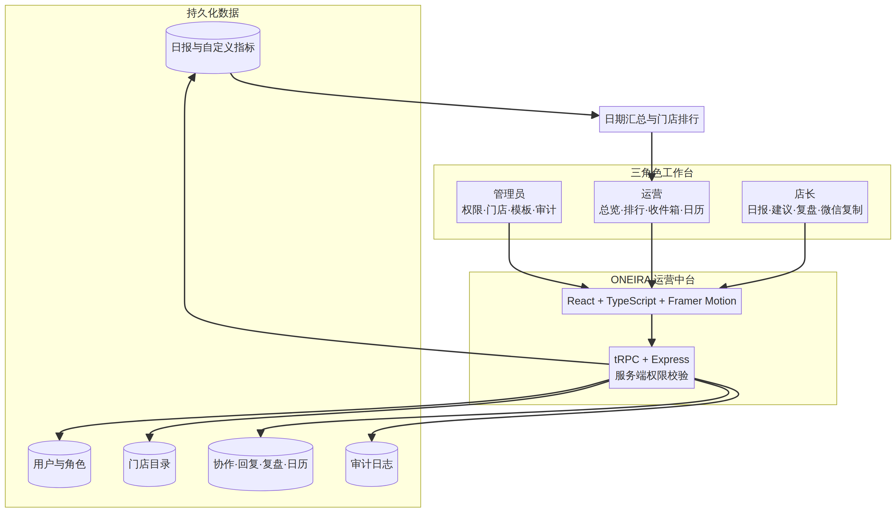
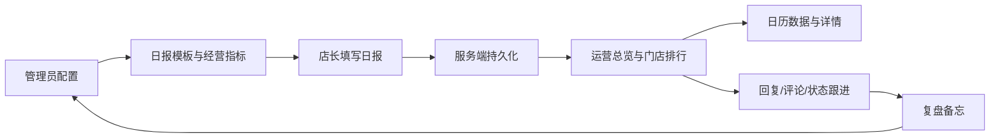

# ONEIRA 梦面包运营中台

> 面向烘焙门店的三角色运营协作系统：管理员维护规则，运营追踪经营，店长沉淀日报与复盘。

## 项目简介

ONEIRA 运营中台将门店日报、经营汇总、协作收件箱、特殊日期日历和复盘备忘串成一条可追踪的运营闭环。

- **管理员**：管理用户角色、门店、日报模板、经营指标、特殊日期和审计记录
- **运营**：查看跨门店日报，按日期/门店汇总，查看经营排行，回复建议与问题，管理运营日历
- **店长**：按管理员模板填写日报，录入西点、蛋挞、赠送产品等自定义指标，复制微信报账群格式，提交建议、问题和复盘

## 功能图示



### 核心工作流



## 角色与模块

| 角色 | 主要模块 | 关键能力 |
|---|---|---|
| 管理员 | 权限与门店 | 用户角色、门店新增/编辑、店长门店绑定 |
| 管理员 | 日报模板 | 字段增删改、分组、必填、微信复制、经营指标配置 |
| 管理员 | 审计与日历 | 操作记录、特殊日期标注与编辑 |
| 运营 | 运营总览 | 今日实收、待跟进、日报、复盘快捷跳转 |
| 运营 | 门店排行 | 营收、报损、试吃、好评排行，点击查看门店详情 |
| 运营 | 日报中心 | 日期/门店筛选，经营数据汇总和比例计算 |
| 运营 | 协作收件箱 | 查看、回复、评论、更新状态 |
| 店长 | 门店日报 | 动态字段录入、自动计算报损/试吃占比、微信复制 |
| 店长 | 复盘与日历 | 门店备忘、查看特殊日期和当天经营数据 |

## 技术架构

- **前端**：React + TypeScript + Vite
- **交互**：Framer Motion + Lucide React
- **接口**：tRPC + Express
- **数据库**：Drizzle ORM + MySQL-compatible database
- **认证**：Manus OAuth 会话与服务端角色权限
- **校验**：Vitest、TypeScript、生产构建检查
- **部署**：SPA 静态资源 + 服务端 API 容器

## 本地开发

```bash
pnpm install
pnpm run dev --host 0.0.0.0 --port 3000
```

生产检查：

```bash
pnpm exec tsc --noEmit
pnpm test --run
pnpm run build
```

## 数据模型说明

日报基础经营字段直接存储在 `oneira_daily_reports`；管理员新增的自定义经营指标由日报模板字段定义，并以 JSON 形式持久化在日报的 `customMetrics` 字段。运营汇总会按筛选日期、门店和字段配置自动计算合计。

## 项目目录

```text
client/src/components/  通用 UI、汇总与日历组件
client/src/pages/       管理员、运营、店长工作台
client/src/types.ts     前端业务类型
server/                 tRPC 路由、权限与服务启动
drizzle/                数据库 Schema、迁移和元数据
public/                 路由清单与品牌资源
```

## 开源说明

本项目用于 ONEIRA 梦面包门店运营中台的产品原型与持续开发。请在部署前配置数据库、认证环境变量和平台运行时配置，不要提交真实门店经营数据或生产密钥。

## 当前版本

最新功能包括门店编辑、管理员可配置汇总指标、运营门店排行、可点击详情和日历经营数据联动。
